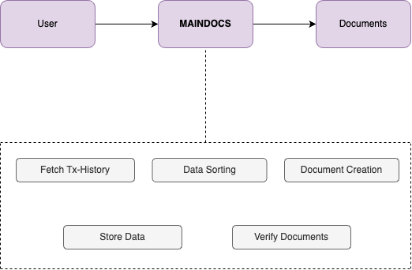
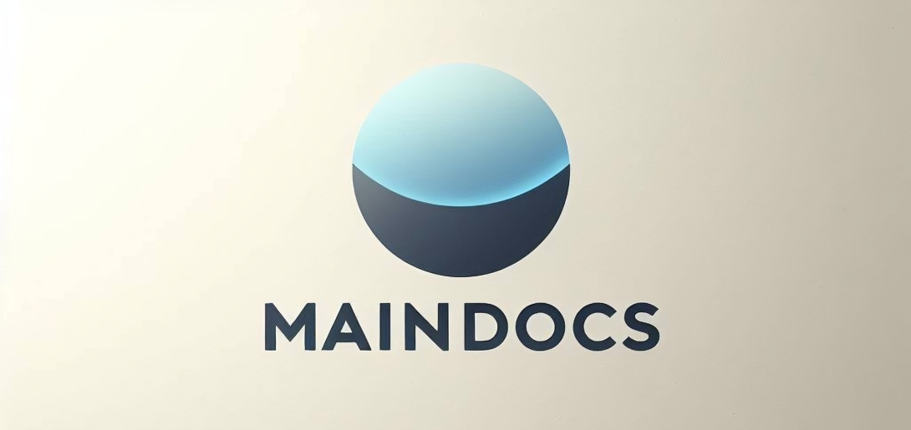

# MAINDOCS

Maindocs enables users to generate fully customizable and verifiable financial documents from their wallet.

### Key Features
- Create customizable documents
- Verify document authenticity
- Secure integration with wallets
- Seamless user experience


## How It Works




## Getting Started

1. Clone this repository

2. Navigate to the project directory

3. Install dependencies

4. Start the development server:

```bash
npm run dev
```

5. Open [http://localhost:3000](http://localhost:3000) with your browser to see the result.

## Usage

1. Connect your wallet to maindocs.

2. Select Fetch Transaction History

3. Select Download csv file


## Learn More

To learn more about Maindocs visit @maindocs on X





